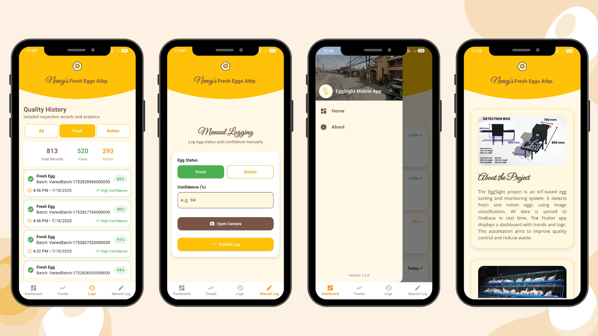

# Egg Sorting Dashboard

A Flutter app integrated with Firebase to automate egg quality inspection and monitoring.

## Features

- Real-time dashboard showing total, fresh, and rotten eggs.
- Visual analytics with pie and line charts for weekly egg quality trends.
- Detailed, filterable inspection logs with confidence scores.
- Manual egg log entry with camera photo capture.
- Background automatic logging simulating egg data.
- Cross-platform support (Android, iOS, Web, macOS, Windows).

## Screenshots



## Getting Started

### Prerequisites

- Flutter SDK installed ([install guide](https://flutter.dev/docs/get-started/install))dd
- Firebase project set up with Firestore enabled.

### Installation

1. Clone the repo:
   ```bash
   git clone https://github.com/your-username/egg-sorting-dashboard.git
   cd egg-sorting-dashboard
